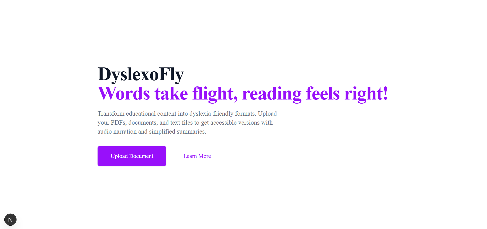
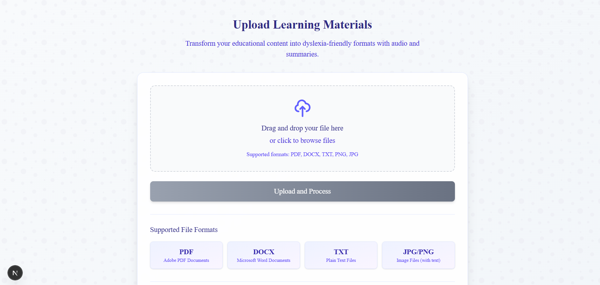
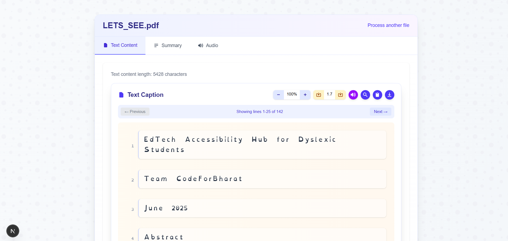
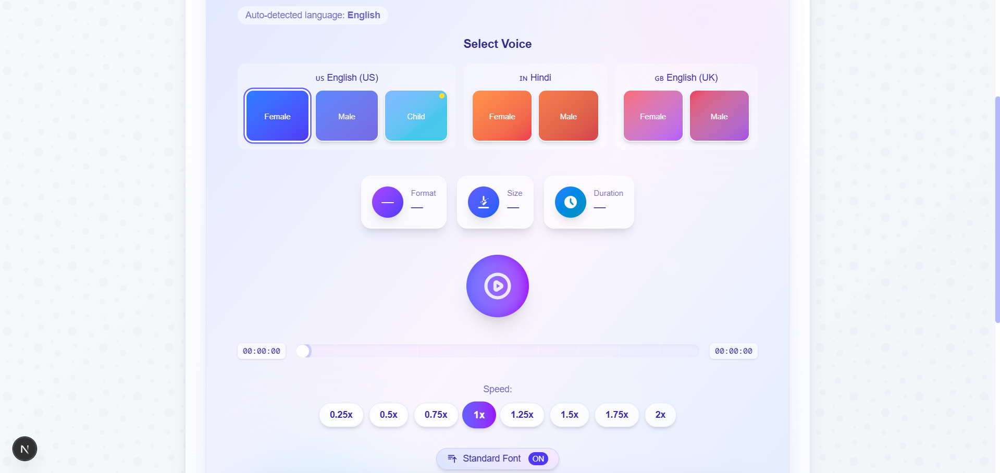

# 📘 DyslexoFly

DyslexoFly is an inclusive EdTech platform built to support dyslexic students by transforming textbooks into more accessible formats. It integrates AI, accessibility principles, and modern web technologies to enhance learning for students with dyslexia.

---

## 🔍 About Dyslexia

Dyslexia is a neurological learning disability that impairs a person's ability to read, write, and spell, despite normal intelligence. This project aims to support dyslexic learners by offering alternative content formats aligned with their strengths — auditory and visual learning.

---

## 🧠 Project Overview

Dyslexia affects over 70 million individuals in India alone. DyslexoFly aims to bridge the educational accessibility gap by enabling students to:

-  Convert text to **OpenDyslexic font**
-  Listen to the content via **Text-to-Speech**
-  Understand faster with **AI-powered summarization**
-  Store and retrieve converted material on the cloud

---

## 🖼️ Project Snapshots

Below are visual previews of the **DyslexoFly** platform in action:

### 🔹 Home Page



### 🔹 Upload Page



### 🔹 Dyslexia-Friendly Text Rendering



### 🔹 Audio



> These images showcase the platform’s core features: file upload, text-to-speech and accessibility-friendly rendering.


## 📁 Directory Structure

```text
DyslexoFly/
├── assets                     # Images for documentation 
│   ├── img1.png             
│   ├── img2.png   
│   ├── img3.png   
│   ├── img4.png   
├── .gitignore
├── audio_outputs/            # Stores TTS-generated audio files
│   └── audio.mp3  # Example audio file
├── backend/
│   ├── app.py                # Main Flask application
│   ├── requirements.txt      # Python dependencies
│   ├── services/
│   │   ├── __init__.py       # Init file for service package
│   │   ├── text_processing.py # Text extraction & preprocessing logic
│   │   ├── tts_service.py    # Text-to-speech conversion logic
│   │   └── __pycache__/      # Python cache files
│   ├── speech/               # Speech-related resources
│   └── static/
│       └── test.html         # Test page for API testing
├── frontend/
│   ├── .gitignore
│   ├── .next/                # Next.js build output
│   ├── public/               # Public static assets
│   │   └── fonts/            # Custom fonts including OpenDyslexic
│   ├── src/
│   │   ├── app/
│   │   │   ├── about/        # About page
│   │   │   ├── globals.css   # Global styles
│   │   │   ├── layout.js     # Root layout component
│   │   │   ├── page.js       # Home page
│   │   │   ├── project-overview/ # Project details page
│   │   │   ├── results/      # Results page (shows processed document)
│   │   │   └── upload/       # Upload page for documents
│   │   └── components/
│   │       ├── AccessibilityMenu.js     # Accessibility controls
│   │       ├── AccessibilityProvider.js # Context provider
│   │       ├── AudioPane.jsx           # Audio player with TTS
│   │       ├── DocumentNavigation.jsx  # Document outline navigation
│   │       ├── Navbar.jsx             # Navigation header
│   │       ├── SummaryPane.jsx        # Document summary display
│   │       └── TextPane.jsx           # Accessible text display
│   ├── eslint.config.mjs
│   ├── next-env.d.ts
│   ├── next.config.ts
│   ├── package.json
│   ├── postcss.config.mjs
│   ├── README.md
│   └── tsconfig.json
├── uploads/                  # Storage for uploaded documents
│   └── _file_tracking.txt    # File tracking metadata
└── venv/                     # Python virtual environment
```

---

## ▶ How to Run the Project

This section explains how to run the **backend**, **frontend**, and configure **Firebase**.

---

###  Backend Setup 

```bash
# 1. Navigate to the backend directory
cd backend

# 2. Install backend dependencies
pip install -r requirements.txt

# 3. Run the backend server
python app.py
```

###  Frontend Setup

```bash
# 1. Navigate to the frontend directory
cd frontend

# 2. Install Node.js dependencies
npm install

# 3. Start the frontend development server
npm run dev

# 4. Open in your browser
http://localhost:3000

```
---
## 👥 Team Details

**Team Name**: The Kamand Crew

**Project Name**: DyslexoFly


**Team Members**:

| Name               | Role                        
|--------------------|-------------------------------|
| Aditya Tayal       | Full Stack and AI integration | 
| Siddhi Pogakwar    | TTS and Text Anayser          |
   
---

